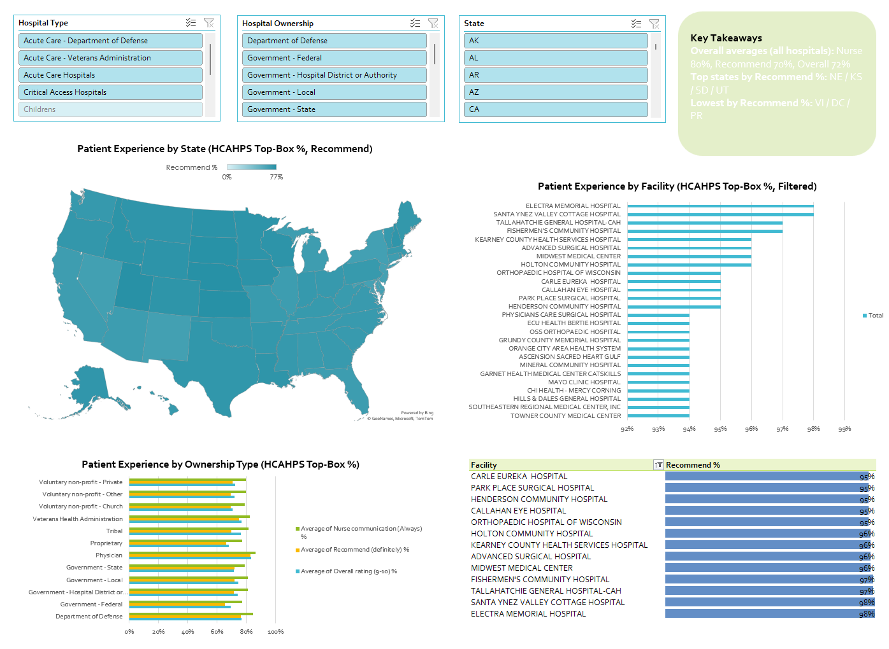
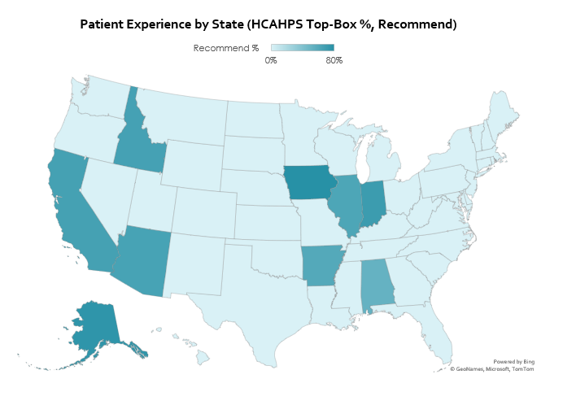

# CMS HCAHPS Patient Experience Dashboard (Excel + Power Query)

  

## Overview
A refreshable Excel dashboard built from CMS Provider Data to compare hospital patient experience by **state**, **ownership type**, and **facility**.

## Data Sources (CMS Provider Data)
- Hospitals: Hospital General Information (CSV)
- Patient Experience: HCAHPS – Hospital Patient Survey (CSV)

## Join Key
- **Facility ID** (stored as **Text** in all queries)

## Data Preparation (Power Query)
- Imported both CSVs with Power Query and standardized data types (Facility ID = Text; dates = Date; KPIs = Number)
- Converted **Not Available / Not Applicable** to null
- Kept the **latest reporting period** using **End Date** and removed duplicates
- Filtered to selected HCAHPS **top-box** measures and pivoted to **one row per hospital**
- Merged HCAHPS KPIs into Hospital General Information using Facility ID

## KPI Definitions (HCAHPS Top-Box %)

### Nurse Communication (Always) %
- **Definition:** CMS-published percentage of surveyed patients selecting **“Always”** for: nurses **“Always communicated well.”**
- **Exact logic:** `HCAHPS Answer Percent` where `HCAHPS Question` = *Patients who reported that their nurses "Always" communicated well* and `HCAHPS Answer Description` = *Always*. Latest `End Date` retained; Not Available/Not Applicable → null.
- **Level:** Hospital-level (per facility per reporting period). Dashboard reports **average across hospitals** when grouped by State/Ownership.
- **Why it matters:** Reflects frontline communication quality and strongly influences patient experience.

### Recommend the Hospital (Yes, definitely) %
- **Definition:** CMS-published percentage of surveyed patients who responded **“Yes, definitely”** to recommending the hospital.
- **Exact logic:** `HCAHPS Answer Percent` where `HCAHPS Question` = *Patients who reported YES, they would definitely recommend the hospital* and `HCAHPS Answer Description` = *Yes, definitely*. Latest `End Date` retained; Not Available/Not Applicable → null.
- **Level:** Hospital-level (per facility per reporting period). Dashboard reports **average across hospitals** by State/Ownership and supports facility-level filtering.
- **Why it matters:** Strong summary indicator of overall satisfaction and patient loyalty.

### Overall Hospital Rating (9–10) %
- **Definition:** CMS-published percentage of surveyed patients rating the hospital **9 or 10** on a 0–10 scale.
- **Exact logic:** `HCAHPS Answer Percent` where `HCAHPS Question` = *Patients who gave their hospital a rating of 9 or 10 on a scale from 0 (lowest) to 10 (highest)* and `HCAHPS Answer Description` matches the top-box category (e.g., *9 and 10*). Latest `End Date` retained; Not Available/Not Applicable → null.
- **Level:** Hospital-level (per facility per reporting period). Dashboard reports **average across hospitals** when grouped by State/Ownership.
- **Why it matters:** Headline patient experience measure capturing broad aspects of care beyond communication alone.

## Dashboard Views
- Patient Experience by State (Top-Box %)
- Patient Experience by Ownership Type (Top-Box %)
- Patient Experience by Facility (Top-Box %, filtered)
- Filled map view (state-level metric)

## Key Takeaways (All Hospitals)
- Overall averages: Nurse **80%**, Recommend **70%**, Overall **72%**
- Top states by Recommend %: **NE / KS / SD / UT**
- Lowest by Recommend %: **VI / DC / PR**

## How to Refresh
Excel → Data → Refresh All  
*(To refresh on another machine, update the Power Query “Source” file paths to your local CSV locations.)*

## Files
- Screenshots are included in `/screenshots/`.
- Workbook available upon request.
